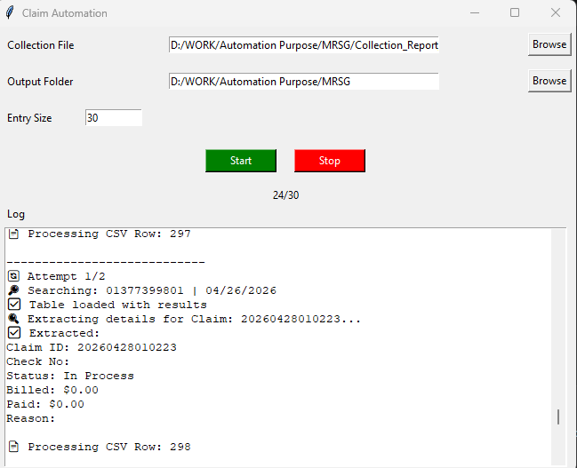
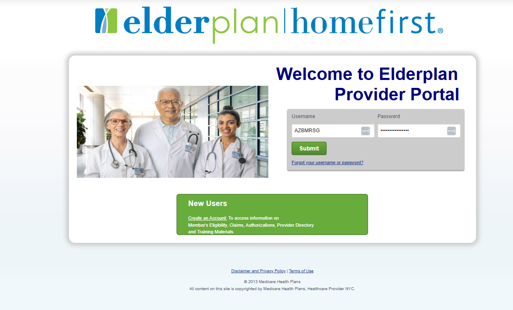
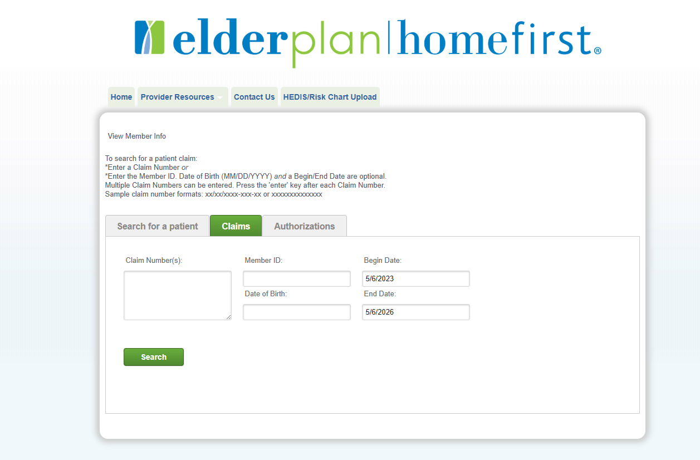
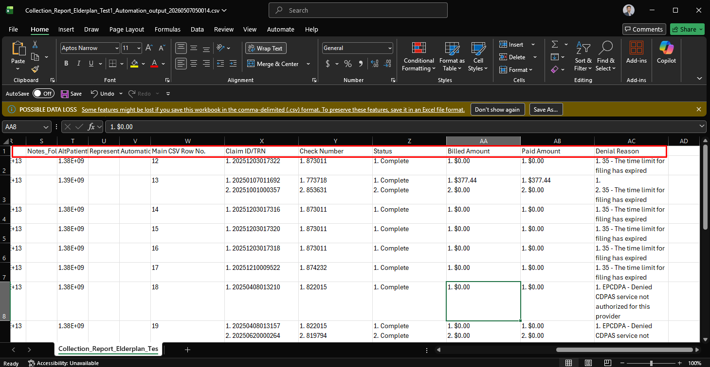

# Elderplan Claim Automation

## Overview

Elderplan Claim Automation is a Python + Playwright based healthcare automation framework designed to automate claim lookup and extraction from the Elderplan portal.

The automation supports:
- Automated claim searching
- Claim detail extraction
- CSV output generation
- GUI-based execution
- Auto resume capability
- Retry logic with jitter
- Real-time logging and progress tracking

The project is designed to improve operational efficiency, reduce repetitive manual work, and provide resilient healthcare portal automation.

---

# Core Features

## Claim Automation
- Automated claim lookup using Member ID and DOS
- Multi-claim extraction support
- Denial reason extraction
- Aggregated claim result handling

---

## GUI Application
- CSV file selection
- Output folder selection
- Entry size control
- Live logging window
- Progress tracking
- Stop button support

---

## Auto Resume Capability
The automation supports resumable execution.

Features:
- Automatically creates `Automation Status` column
- Marks completed rows as `DONE`
- Skips completed rows during rerun
- Continues processing remaining rows automatically

---

## Retry Logic with Jitter
The automation includes retry protection for unstable portal behavior.

Features:
- Automatic retry attempts
- Randomized retry delay (jitter)
- Graceful fallback handling

This improves resilience against:
- Temporary portal failures
- Delayed page loads
- Intermittent timeouts

---

## Browser Automation
- Automatic Microsoft Edge launch
- Automatic portal tab detection
- CDP-based browser connection
- Manual login workflow support

---

# Technology Stack

| Component | Technology |
|---|---|
| Programming Language | Python |
| Browser Automation | Playwright |
| GUI Framework | Tkinter |
| Browser | Microsoft Edge |
| Data Handling | CSV |

---

# Project Structure

project/
│
├── gui.py
├── main.py
├── search.py
├── result.py
├── setup.py
├── save_csv.py
├── README.md

---

# Portal Navigation

Before starting automation:

1. Login to Elderplan portal
2. Open "View Member Info" page
3. Keep the tab open
4. Start automation from GUI

---

# Expected Workflow

1. Launch the application
2. Select input CSV file
3. Select output folder
4. Click **Start**
5. Microsoft Edge launches automatically
6. Login to the Elderplan portal
7. Navigate to the automation start interface/tab
8. Click **Start** again from the GUI
9. Automation detects the portal automatically
10. Claim processing begins
11. Monitor live progress and logs from the GUI
12. Automation completes processing
13. Output CSV is generated

---

## Image

